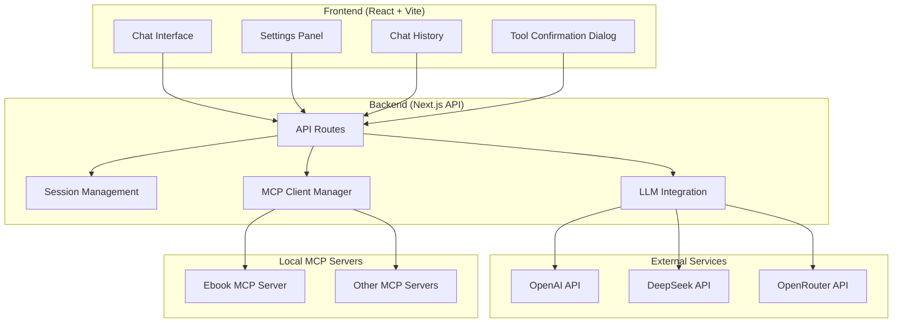

# Design Document

## Overview

The MCP Chat UI is a modern web application that provides a secure, local-first chat interface for interacting with frontier LLMs while leveraging local MCP (Model Context Protocol) servers for tool execution. The system implements a three-tier architecture ensuring data privacy and user control over AI tool execution.

The application consists of a React frontend built with Vite, a Next.js backend for API handling, and integration with local MCP servers. All processing occurs locally, with no external data transmission except for LLM API calls using user-provided credentials.

## Architecture

### High-Level Architecture



### Technology Stack

**Frontend:**
- React 18 with TypeScript for type safety and modern React features
- Vite for fast development and optimized builds
- Tailwind CSS for consistent, utility-first styling
- Zustand for lightweight state management
- React Router for client-side routing
- react-i18next for internationalization support

**Backend:**
- Next.js 15 with App Router for API routes and server-side functionality
- @modelcontextprotocol/sdk for MCP server communication
- OpenAI SDK for LLM integration (compatible with OpenAI, DeepSeek, OpenRouter)
- Node.js built-in modules for file system operations

**Development Tools:**
- TypeScript for static type checking
- ESLint and Prettier for code quality
- Tailwind CSS IntelliSense for enhanced development experience
- i18next-parser for translation key extraction

## Components and Interfaces

### Frontend Components

#### Core Layout Components

**AppLayout**
- Main application shell with sidebar and content area
- Responsive design that adapts to mobile/desktop
- Navigation between chat, settings, and history views

**Sidebar**
- Chat history list with auto-generated titles
- New chat button with provider/model selection
- Settings and configuration access
- Search functionality for chat history

#### Chat Components

**ChatPage**
- Main chat interface container
- Message list with auto-scrolling
- Input area with send button and keyboard shortcuts
- Loading states and error handling

**MessageList**
- Renders conversation history
- Supports different message types (user, assistant, tool, system)
- Markdown rendering for formatted content
- Copy message functionality

**MessageInput**
- Text input with auto-resize
- Send button with loading state
- Keyboard shortcuts (Enter to send, Shift+Enter for new line)
- Character count and input validation

**ToolConfirmationDialog**
- Modal dialog for tool execution approval
- Displays tool name, description, and parameters
- Run/Cancel buttons with clear visual hierarchy
- Parameter preview with syntax highlighting

#### Settings Components

**SettingsPage**
- Tabbed interface for different configuration sections
- LLM provider configuration
- MCP server management
- Application preferences
- Language selection with English/Chinese support

**LLMProviderConfig**
- Provider selection (OpenAI, DeepSeek, OpenRouter)
- API key input with secure storage
- Model selection with tool calling support indication
- Connection testing functionality

**MCPServerConfig**
- JSON configuration editor with syntax highlighting
- Server status indicators
- Add/remove/edit server configurations
- Connection testing and tool listing

### Backend API Interfaces

#### API Routes

**POST /api/chat**
```typescript
interface ChatRequest {
  messages: Message[];
  sessionId: string;
  provider: LLMProvider;
  model: string;
}

interface ChatResponse {
  reply?: string;
  toolCalls?: ToolCall[];
  sessionId: string;
}
```

**POST /api/run-tool**
```typescript
interface RunToolRequest {
  toolCall: ToolCall;
  sessionId: string;
  messages: Message[];
}

interface RunToolResponse {
  result: string;
  reply: string;
  error?: string;
}
```

**GET/POST /api/settings**
```typescript
interface Settings {
  llmProviders: LLMProviderConfig[];
  mcpServers: MCPServerConfig[];
  preferences: UserPreferences;
}
```

**GET /api/chat-history**
```typescript
interface ChatHistoryResponse {
  sessions: ChatSession[];
}

interface ChatSession {
  id: string;
  title: string;
  createdAt: string;
  updatedAt: string;
  messageCount: number;
  provider: string;
  model: string;
}
```

#### Core Services

**MCPClientManager**
- Manages connections to multiple MCP servers
- Handles server lifecycle (connect, disconnect, reconnect)
- Provides unified tool listing and execution interface
- Implements connection pooling and error recovery

**LLMService**
- Abstracts different LLM providers behind unified interface
- Handles API key management and request formatting
- Implements retry logic and error handling
- Supports streaming responses for real-time chat experience

**SessionManager**
- Manages chat session state and persistence
- Handles message history and context management
- Implements session cleanup and garbage collection
- Provides session search and filtering capabilities

## Data Models

### Core Data Types

```typescript
interface Message {
  id: string;
  role: 'user' | 'assistant' | 'tool' | 'system';
  content: string;
  timestamp: Date;
  toolCalls?: ToolCall[];
  toolCallId?: string;
}

interface ToolCall {
  id: string;
  type: 'function';
  function: {
    name: string;
    arguments: string;
  };
}

interface ChatSession {
  id: string;
  title: string;
  messages: Message[];
  createdAt: Date;
  updatedAt: Date;
  provider: LLMProvider;
  model: string;
  mcpServers: string[];
}

interface LLMProviderConfig {
  id: string;
  name: 'openai' | 'deepseek' | 'openrouter';
  apiKey: string;
  baseUrl?: string;
  models: ModelInfo[];
}

interface ModelInfo {
  id: string;
  name: string;
  supportsToolCalling: boolean;
  maxTokens: number;
}

interface MCPServerConfig {
  id: string;
  name: string;
  command: string;
  args: string[];
  env?: Record<string, string>;
  enabled: boolean;
  status: 'connected' | 'disconnected' | 'error';
}

interface MCPTool {
  name: string;
  description: string;
  inputSchema: object;
  serverId: string;
}
```

### Internationalization

**Language Support**
- Default language: English (en)
- Supported languages: English, Chinese (zh)
- react-i18next for translation management
- Automatic language detection based on browser settings
- Manual language switching in settings

**Translation Structure**
```typescript
interface TranslationKeys {
  common: {
    save: string;
    cancel: string;
    delete: string;
    edit: string;
    loading: string;
  };
  chat: {
    sendMessage: string;
    newChat: string;
    toolConfirmation: string;
    runTool: string;
    cancelTool: string;
  };
  settings: {
    llmProvider: string;
    mcpServers: string;
    language: string;
    theme: string;
  };
  errors: {
    connectionFailed: string;
    invalidApiKey: string;
    toolExecutionFailed: string;
  };
}
```

**Implementation Details**
- Translation files stored in `src/locales/[lang]/translation.json`
- Lazy loading of translation files
- Pluralization support for count-based messages
- Date and time formatting based on locale
- RTL support preparation (for future languages)

### State Management

**Chat Store (Zustand)**
```typescript
interface ChatStore {
  // Current session state
  currentSession: ChatSession | null;
  messages: Message[];
  isLoading: boolean;
  pendingToolCall: ToolCall | null;
  
  // Actions
  sendMessage: (content: string) => Promise<void>;
  confirmToolCall: (toolCall: ToolCall) => Promise<void>;
  cancelToolCall: () => void;
  loadSession: (sessionId: string) => Promise<void>;
  createNewSession: (provider: string, model: string) => void;
}
```

**Settings Store (Zustand)**
```typescript
interface UserPreferences {
  theme: 'light' | 'dark' | 'system';
  language: 'en' | 'zh';
  autoScroll: boolean;
  soundEnabled: boolean;
}

interface SettingsStore {
  // Configuration state
  llmProviders: LLMProviderConfig[];
  mcpServers: MCPServerConfig[];
  preferences: UserPreferences;
  
  // Actions
  updateLLMProvider: (config: LLMProviderConfig) => void;
  updateMCPServer: (config: MCPServerConfig) => void;
  updatePreferences: (preferences: Partial<UserPreferences>) => void;
  changeLanguage: (language: 'en' | 'zh') => void;
  testConnection: (providerId: string) => Promise<boolean>;
  loadSettings: () => Promise<void>;
  saveSettings: () => Promise<void>;
}
```

## Error Handling

### Frontend Error Handling

**Error Boundaries**
- React error boundaries to catch and display component errors
- Graceful degradation when components fail
- Error reporting and recovery suggestions

**API Error Handling**
- Standardized error response format
- User-friendly error messages
- Retry mechanisms for transient failures
- Offline state detection and handling

**Validation**
- Input validation for all user inputs
- Real-time validation feedback
- Schema validation for configuration files

### Backend Error Handling

**MCP Connection Errors**
- Automatic reconnection with exponential backoff
- Fallback behavior when servers are unavailable
- Clear error messages for configuration issues

**LLM API Errors**
- Rate limiting and quota management
- API key validation and error reporting
- Model availability checking

**Session Management Errors**
- Session recovery from corrupted state
- Automatic cleanup of invalid sessions
- Data consistency checks

## Testing Strategy

### Unit Testing

**Frontend Components**
- React Testing Library for component testing
- Mock API responses for isolated testing
- Accessibility testing with jest-axe
- Visual regression testing with Storybook
- Internationalization testing with different locales

**Backend Services**
- Jest for service layer testing
- Mock MCP servers for integration testing
- API endpoint testing with supertest
- Database operation testing

### Integration Testing

**End-to-End Workflows**
- Playwright for full application testing
- Chat flow testing with tool execution
- Settings configuration testing
- Session management testing

**MCP Integration**
- Test with real MCP servers
- Tool execution validation
- Error scenario testing
- Performance testing under load

### Performance Testing

**Frontend Performance**
- Bundle size optimization
- Rendering performance with large chat histories
- Memory usage monitoring
- Mobile performance testing

**Backend Performance**
- API response time monitoring
- Concurrent session handling
- MCP server connection pooling
- Memory leak detection

## Security Considerations

### Data Privacy

**Local-First Architecture**
- All chat data stored locally in browser
- No external data transmission except LLM APIs
- User control over data retention and deletion

**API Key Security**
- Encrypted storage in browser local storage
- No server-side API key storage
- Secure transmission over HTTPS only

### Input Validation

**User Input Sanitization**
- XSS prevention in chat messages
- JSON schema validation for configurations
- File upload restrictions and validation

**API Security**
- Request rate limiting
- Input validation on all endpoints
- CORS configuration for local development

### MCP Server Security

**Process Isolation**
- MCP servers run in separate processes
- Limited file system access
- Environment variable isolation

**Tool Execution Safety**
- User confirmation required for all tool calls
- Parameter validation before execution
- Execution timeout and resource limits