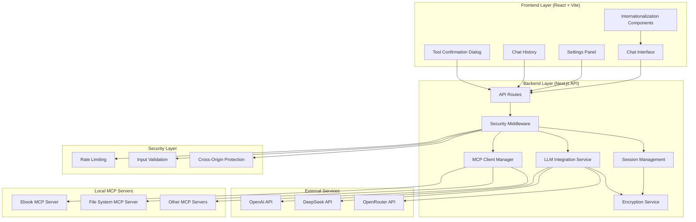

# MCP Chat UI Design Document

## Project Overview

MCP Chat UI is a modern web application that provides users with a secure, local-first chat interface for interacting with frontier large language models while leveraging local MCP (Model Context Protocol) servers for tool execution. The system implements a three-tier architecture ensuring data privacy and complete user control over AI tool execution.

### Core Design Principles

1. **Local-First**: All data processing occurs locally, communicating with LLM APIs only when necessary
2. **Security-First**: Encrypted API key storage, user input validation, XSS protection
3. **User Control**: Tool execution requires explicit user confirmation with transparent operation flow
4. **Modern Architecture**: Uses latest web technology stack ensuring maintainability and extensibility
5. **Internationalization Support**: Multi-language interface adapting to different regional user needs

### Technical Architecture Overview

The application consists of three main layers:
- **Frontend Layer**: Modern user interface built with React + Vite
- **Backend Layer**: Next.js API routes handling business logic and data management
- **Integration Layer**: Seamless integration with local MCP servers

All processing occurs locally, with no external data transmission except for LLM API calls using user-provided credentials.

## System Architecture

### High-Level Architecture Design



### Technology Stack Selection

**Frontend Technology Stack:**
- **React 18 + TypeScript**: Provides type safety and modern React features
- **Vite**: Fast development build tool with optimized production builds
- **Tailwind CSS**: Consistent utility-first styling system
- **Zustand**: Lightweight state management solution
- **React Router**: Client-side routing management
- **react-i18next**: Complete internationalization support framework

**Backend Technology Stack:**
- **Next.js 15 + App Router**: Modern full-stack React framework
- **@modelcontextprotocol/sdk**: Official MCP protocol SDK
- **OpenAI SDK**: Unified interface compatible with multiple LLM providers
- **Node.js Built-in Modules**: File system and encryption operations

**Security & Tools:**
- **AES Encryption**: Encrypted storage for API keys and sensitive data
- **Input Validation**: Prevention of XSS attacks and malicious input
- **Rate Limiting**: API call frequency control
- **CORS Configuration**: Cross-origin request security control

**Development Tools:**
- **TypeScript**: Static type checking and intelligent code completion
- **ESLint + Prettier**: Code quality and formatting tools
- **Tailwind CSS IntelliSense**: Enhanced development experience
- **i18next-parser**: Automatic translation key extraction tool

## Component Design and Interfaces

### Frontend Component Architecture

#### Core Layout Components

**AppLayout (Application Layout)**
- Main application shell containing sidebar and content area
- Responsive design adapting to mobile and desktop
- Navigation between chat, settings, and history views
- Multi-language switching and theme switching support

**Sidebar**
- Chat history list with auto-generated titles
- New chat button with provider/model selection support
- Settings and configuration access entry
- Chat history search functionality
- Language switcher and user preference settings

#### Chat Components

**ChatPage**
- Main chat interface container
- Auto-scrolling message list
- Input area with send button and keyboard shortcuts
- Loading states and error handling
- Tool execution status indicators

**MessageList**
- Renders conversation history
- Supports different message types (user, assistant, tool, system)
- Markdown content formatting and rendering
- Message copy and export functionality
- Message timestamps and status indicators

**MessageInput**
- Auto-resizing text input field
- Send button with loading state
- Keyboard shortcuts (Enter to send, Shift+Enter for new line)
- Character count and input validation
- Multi-language input support

**ToolConfirmationDialog**
- Modal dialog for tool execution approval
- Displays tool name, description, and parameters
- Run/Cancel buttons with clear visual hierarchy
- Parameter preview with syntax highlighting
- Security warnings and risk notifications

#### Settings Components

**SettingsPage**
- Tabbed interface for different configuration sections
- LLM provider configuration
- MCP server management
- Application preference settings
- Multi-language selection (English/Chinese support)
- Data export and privacy cleanup options

**LLMProviderConfig**
- Provider selection (OpenAI, DeepSeek, OpenRouter)
- API key input with secure storage
- Model selection with tool calling support indication
- Connection testing functionality
- API key masked display (showing only last 4 characters)

**MCPServerConfig**
- JSON configuration editor with syntax highlighting
- Server status indicators
- Add/remove/edit server configurations
- Connection testing and tool list display
- Configuration validation and error notifications

### 后端 API 接口设计

#### 核心 API 路由

**POST /api/chat（聊天接口）**
```typescript
interface ChatRequest {
  messages: Message[];
  sessionId: string;
  provider: LLMProvider;
  model: string;
  mcpServers?: string[];
}

interface ChatResponse {
  reply?: string;
  toolCalls?: ToolCall[];
  sessionId: string;
  usage?: TokenUsage;
  error?: string;
}
```

**POST /api/run-tool（工具执行接口）**
```typescript
interface RunToolRequest {
  toolCall: ToolCall;
  sessionId: string;
  messages: Message[];
  approved: boolean;
}

interface RunToolResponse {
  result: string;
  reply: string;
  error?: string;
  executionTime: number;
}
```

**GET/POST /api/settings（设置管理接口）**
```typescript
interface Settings {
  llmProviders: LLMProviderConfig[];
  mcpServers: MCPServerConfig[];
  preferences: UserPreferences;
  security: SecuritySettings;
}

interface SecuritySettings {
  encryptionEnabled: boolean;
  sessionTimeout: number;
  maxRequestsPerMinute: number;
}
```

**GET /api/chat-history（聊天历史接口）**
```typescript
interface ChatHistoryResponse {
  sessions: ChatSession[];
  totalCount: number;
  hasMore: boolean;
}

interface ChatSession {
  id: string;
  title: string;
  createdAt: string;
  updatedAt: string;
  messageCount: number;
  provider: string;
  model: string;
  tags?: string[];
  archived: boolean;
}
```

#### 安全相关 API

**POST /api/settings/test-connection（连接测试）**
```typescript
interface TestConnectionRequest {
  provider: LLMProvider;
  apiKey: string;
  baseUrl?: string;
}

interface TestConnectionResponse {
  success: boolean;
  error?: string;
  models?: ModelInfo[];
}
```

**POST /api/export/chat-history（数据导出）**
```typescript
interface ExportRequest {
  sessionIds?: string[];
  format: 'json' | 'markdown';
  includeSensitiveData: boolean;
}

interface ExportResponse {
  data: string;
  filename: string;
  contentType: string;
}
```

**POST /api/privacy/cleanup（隐私清理）**
```typescript
interface CleanupRequest {
  type: 'sessions' | 'settings' | 'all';
  olderThan?: Date;
  confirmed: boolean;
}

interface CleanupResponse {
  deletedCount: number;
  success: boolean;
}
```

#### Core Service Components

**MCPClientManager**
- Manages connections to multiple MCP servers
- Handles server lifecycle (connect, disconnect, reconnect)
- Provides unified tool listing and execution interface
- Implements connection pooling and error recovery mechanisms
- Supports dynamic server configuration updates
- Tool call permission verification and security checks

**LLMService**
- Abstracts different LLM providers behind unified interface
- Handles API key management and request formatting
- Implements retry logic and error handling
- Supports streaming responses for real-time chat experience
- Token usage statistics and cost tracking
- Model capability detection and compatibility verification

**SessionManager**
- Manages chat session state and persistence
- Handles message history and context management
- Implements session cleanup and garbage collection
- Provides session search and filtering capabilities
- Automatic session title generation using LLM based on conversation content
- Session organization features (rename, delete, archive)
- Session data encryption and secure storage

**SecureSettingsManager**
- AES encrypted storage and management of API keys
- Secure handling of sensitive configuration data
- Settings data import/export functionality
- Configuration validation and integrity checks
- Automatic backup and recovery mechanisms

**SecurityMiddleware**
- Request rate limiting and protection
- Input validation and XSS protection
- CORS configuration and security header settings
- Session timeout and cleanup management
- Security audit logging

## 数据模型设计

### 核心数据类型

```typescript
// 消息数据模型
interface Message {
  id: string;
  role: 'user' | 'assistant' | 'tool' | 'system';
  content: string;
  timestamp: Date;
  toolCalls?: ToolCall[];
  toolCallId?: string;
  metadata?: MessageMetadata;
  edited?: boolean;
  editHistory?: string[];
}

interface MessageMetadata {
  tokenCount?: number;
  processingTime?: number;
  model?: string;
  temperature?: number;
}

// 工具调用数据模型
interface ToolCall {
  id: string;
  type: 'function';
  function: {
    name: string;
    arguments: string;
  };
  serverId: string;
  approved?: boolean;
  executionTime?: number;
  result?: string;
  error?: string;
}

// 聊天会话数据模型
interface ChatSession {
  id: string;
  title: string;
  messages: Message[];
  createdAt: Date;
  updatedAt: Date;
  provider: LLMProvider;
  model: string;
  mcpServers: string[];
  tags: string[];
  archived: boolean;
  totalTokens: number;
  estimatedCost: number;
}

// LLM 提供商配置
interface LLMProviderConfig {
  id: string;
  name: 'openai' | 'deepseek' | 'openrouter';
  displayName: string;
  apiKey: string; // 加密存储
  baseUrl?: string;
  models: ModelInfo[];
  enabled: boolean;
  rateLimits: RateLimitConfig;
}

interface ModelInfo {
  id: string;
  name: string;
  displayName: string;
  supportsToolCalling: boolean;
  maxTokens: number;
  costPer1kTokens: {
    input: number;
    output: number;
  };
  deprecated?: boolean;
}

interface RateLimitConfig {
  requestsPerMinute: number;
  tokensPerMinute: number;
  dailyLimit?: number;
}

// MCP 服务器配置
interface MCPServerConfig {
  id: string;
  name: string;
  displayName: string;
  command: string;
  args: string[];
  env?: Record<string, string>;
  enabled: boolean;
  status: 'connected' | 'disconnected' | 'error' | 'connecting';
  lastConnected?: Date;
  errorMessage?: string;
  tools: MCPTool[];
  version?: string;
}

interface MCPTool {
  name: string;
  description: string;
  inputSchema: object;
  serverId: string;
  category?: string;
  dangerous?: boolean;
  requiresConfirmation: boolean;
}

// 用户偏好设置
interface UserPreferences {
  theme: 'light' | 'dark' | 'system';
  language: 'en' | 'zh';
  autoScroll: boolean;
  soundEnabled: boolean;
  confirmToolCalls: boolean;
  showTokenCount: boolean;
  autoGenerateTitles: boolean;
  maxHistoryLength: number;
  exportFormat: 'json' | 'markdown';
}

// 安全设置
interface SecuritySettings {
  encryptionEnabled: boolean;
  sessionTimeout: number; // 分钟
  maxRequestsPerMinute: number;
  allowedOrigins: string[];
  logLevel: 'error' | 'warn' | 'info' | 'debug';
  auditEnabled: boolean;
}

// 系统统计
interface SystemStats {
  totalSessions: number;
  totalMessages: number;
  totalTokensUsed: number;
  estimatedTotalCost: number;
  activeConnections: number;
  uptime: number;
  lastBackup?: Date;
}
```

### Internationalization Design

**Language Support Strategy**
- Default language: English (en)
- Supported languages: English, Chinese (zh)
- Uses react-i18next for translation management
- Automatic language detection based on browser settings
- Manual language switching in settings
- Architecture support reserved for future language extensions

**Translation Structure Design**
```typescript
interface TranslationKeys {
  // Common vocabulary
  common: {
    save: string;
    cancel: string;
    delete: string;
    edit: string;
    loading: string;
    confirm: string;
    success: string;
    error: string;
    warning: string;
    info: string;
  };
  
  // Chat related
  chat: {
    sendMessage: string;
    newChat: string;
    toolConfirmation: string;
    runTool: string;
    cancelTool: string;
    messageInput: string;
    chatHistory: string;
    clearHistory: string;
    exportChat: string;
    copyMessage: string;
    regenerateResponse: string;
  };
  
  // Settings related
  settings: {
    llmProvider: string;
    mcpServers: string;
    language: string;
    theme: string;
    preferences: string;
    security: string;
    apiKey: string;
    testConnection: string;
    connectionStatus: string;
    serverConfiguration: string;
  };
  
  // Error messages
  errors: {
    connectionFailed: string;
    invalidApiKey: string;
    toolExecutionFailed: string;
    networkError: string;
    configurationError: string;
    validationError: string;
    serverUnavailable: string;
    rateLimitExceeded: string;
  };
  
  // Tool related
  tools: {
    confirmExecution: string;
    toolDescription: string;
    parameters: string;
    executionResult: string;
    executionTime: string;
    dangerousOperation: string;
    securityWarning: string;
  };
  
  // Session management
  sessions: {
    newSession: string;
    renameSession: string;
    deleteSession: string;
    archiveSession: string;
    searchSessions: string;
    sessionTitle: string;
    lastUpdated: string;
    messageCount: string;
  };
}
```

**Implementation Details**
- Translation files stored in `src/locales/[lang]/translation.json`
- Lazy loading mechanism for translation files
- Pluralization support for count-based messages
- Date and time formatting based on locale settings
- Localization of number and currency formatting
- RTL (Right-to-Left) language support preparation
- Automatic extraction and validation tools for translation keys

### 状态管理架构

**聊天状态管理 (Zustand)**
```typescript
interface ChatStore {
  // 当前会话状态
  currentSession: ChatSession | null;
  messages: Message[];
  isLoading: boolean;
  pendingToolCall: ToolCall | null;
  streamingMessage: string;
  error: string | null;
  
  // 会话历史
  sessions: ChatSession[];
  searchQuery: string;
  filteredSessions: ChatSession[];
  
  // 操作方法
  sendMessage: (content: string) => Promise<void>;
  confirmToolCall: (toolCall: ToolCall) => Promise<void>;
  cancelToolCall: () => void;
  loadSession: (sessionId: string) => Promise<void>;
  createNewSession: (provider: string, model: string) => void;
  deleteSession: (sessionId: string) => Promise<void>;
  renameSession: (sessionId: string, title: string) => Promise<void>;
  archiveSession: (sessionId: string) => Promise<void>;
  searchSessions: (query: string) => void;
  exportSession: (sessionId: string, format: 'json' | 'markdown') => Promise<void>;
  clearError: () => void;
  
  // 消息操作
  editMessage: (messageId: string, content: string) => Promise<void>;
  deleteMessage: (messageId: string) => Promise<void>;
  copyMessage: (messageId: string) => void;
  regenerateResponse: (messageId: string) => Promise<void>;
}
```

**设置状态管理 (Zustand)**
```typescript
interface SettingsStore {
  // 配置状态
  llmProviders: LLMProviderConfig[];
  mcpServers: MCPServerConfig[];
  preferences: UserPreferences;
  security: SecuritySettings;
  systemStats: SystemStats;
  
  // 连接状态
  connectionStatus: Record<string, 'connected' | 'disconnected' | 'testing'>;
  lastTestResults: Record<string, TestResult>;
  
  // 操作方法
  updateLLMProvider: (config: LLMProviderConfig) => Promise<void>;
  deleteLLMProvider: (providerId: string) => Promise<void>;
  updateMCPServer: (config: MCPServerConfig) => Promise<void>;
  deleteMCPServer: (serverId: string) => Promise<void>;
  updatePreferences: (preferences: Partial<UserPreferences>) => Promise<void>;
  updateSecurity: (security: Partial<SecuritySettings>) => Promise<void>;
  
  // 语言和主题
  changeLanguage: (language: 'en' | 'zh') => Promise<void>;
  changeTheme: (theme: 'light' | 'dark' | 'system') => void;
  
  // 连接测试
  testConnection: (providerId: string) => Promise<TestResult>;
  testMCPServer: (serverId: string) => Promise<TestResult>;
  
  // 数据管理
  loadSettings: () => Promise<void>;
  saveSettings: () => Promise<void>;
  exportSettings: () => Promise<string>;
  importSettings: (data: string) => Promise<void>;
  resetSettings: () => Promise<void>;
  
  // 隐私和清理
  clearChatHistory: (olderThan?: Date) => Promise<void>;
  clearSensitiveData: () => Promise<void>;
  getPrivacyReport: () => Promise<PrivacyReport>;
}

interface TestResult {
  success: boolean;
  error?: string;
  latency?: number;
  timestamp: Date;
  details?: any;
}

interface PrivacyReport {
  totalSessions: number;
  totalMessages: number;
  encryptedData: number;
  lastCleanup: Date;
  recommendations: string[];
}
```

**UI 状态管理 (Zustand)**
```typescript
interface UIStore {
  // 界面状态
  sidebarOpen: boolean;
  currentView: 'chat' | 'settings' | 'history';
  theme: 'light' | 'dark' | 'system';
  language: 'en' | 'zh';
  
  // 模态框状态
  modals: {
    toolConfirmation: boolean;
    settings: boolean;
    sessionRename: boolean;
    deleteConfirmation: boolean;
  };
  
  // 通知状态
  notifications: Notification[];
  
  // 操作方法
  toggleSidebar: () => void;
  setCurrentView: (view: 'chat' | 'settings' | 'history') => void;
  openModal: (modal: keyof UIStore['modals']) => void;
  closeModal: (modal: keyof UIStore['modals']) => void;
  addNotification: (notification: Omit<Notification, 'id'>) => void;
  removeNotification: (id: string) => void;
  clearNotifications: () => void;
}

interface Notification {
  id: string;
  type: 'success' | 'error' | 'warning' | 'info';
  title: string;
  message: string;
  duration?: number;
  actions?: NotificationAction[];
}

interface NotificationAction {
  label: string;
  action: () => void;
  style?: 'primary' | 'secondary' | 'danger';
}
```

## Error Handling Strategy

### Frontend Error Handling

**Error Boundaries**
- React error boundaries to catch and display component errors
- Graceful degradation when components fail
- Error reporting and recovery suggestions
- Secure handling of error stack information (hiding sensitive info in production)

**API Error Handling**
- Standardized error response format
- User-friendly error messages (multi-language support)
- Retry mechanisms for transient failures (exponential backoff)
- Offline state detection and handling
- Network timeout and connection failure handling

**Input Validation**
- Real-time validation for all user inputs
- Real-time validation feedback and error notifications
- JSON Schema validation for configuration files
- XSS and injection attack protection

**State Error Handling**
- Error state management in Zustand stores
- Error recovery and state reset mechanisms
- Error logging and analysis

### Backend Error Handling

**MCP Connection Errors**
- Automatic reconnection with exponential backoff
- Fallback behavior when servers are unavailable
- Clear error messages for configuration issues
- Connection pool management and resource cleanup
- Server health checks and monitoring

**LLM API Errors**
- Rate limiting and quota management
- API key validation and error reporting
- Model availability checking and fallback
- Token limits and cost control
- Streaming response error handling

**Session Management Errors**
- Session recovery from corrupted state
- Automatic cleanup of invalid sessions
- Data consistency checks and repair
- Conflict resolution for concurrent access
- Data backup and recovery mechanisms

**Security Error Handling**
- Encryption/decryption failure handling
- Permission validation errors
- Malicious request detection and blocking
- Audit logging
- Security event notification mechanisms

## Testing Strategy

### Unit Testing

**Frontend Component Testing**
- Component testing using React Testing Library
- Isolated testing with mocked API responses
- Accessibility testing using jest-axe
- Visual regression testing using Storybook
- Internationalization testing with different locales
- Multi-device testing for responsive design

**Backend Service Testing**
- Service layer testing using Jest
- Integration testing with mocked MCP servers
- API endpoint testing using supertest
- Database operations and persistence testing
- Encryption services and security feature testing

**State Management Testing**
- State change testing for Zustand stores
- Asynchronous operations and side effects testing
- Error state and recovery mechanism testing
- State persistence and recovery testing

### Integration Testing

**End-to-End Workflow Testing**
- Full application testing using Playwright
- Chat flow and tool execution testing
- Settings configuration and validation testing
- Session management and history testing
- Multi-language interface switching testing

**MCP Integration Testing**
- Testing with real MCP servers
- Tool execution validation and result verification
- Error scenarios and exception handling testing
- Performance testing under load
- Connection stability and reconnection testing

**Security Testing**
- API key encryption and decryption testing
- Input validation and XSS protection testing
- Rate limiting and protection mechanism testing
- Permission validation and access control testing
- Data leakage and privacy protection testing

### Performance Testing

**Frontend Performance**
- Bundle size optimization and analysis
- Rendering performance with large chat histories
- Memory usage monitoring and leak detection
- Mobile device performance testing
- Adaptability testing for changing network conditions

**Backend Performance**
- API response time monitoring and optimization
- Concurrent session handling capacity testing
- MCP server connection pool performance
- Memory leak detection and resource management
- Database query performance optimization

**Load Testing**
- High concurrency user scenario simulation
- Processing capacity for large numbers of tool calls
- System resource usage limit testing
- Failure recovery and degradation testing
- Scalability and capacity planning testing

### Automated Testing Pipeline

**Continuous Integration (CI)**
- GitHub Actions automated testing pipeline
- Automatic test execution on code commits
- Test coverage reports and quality gates
- Multi-environment (development, testing, production) deployment testing

**Test Data Management**
- Automatic generation and cleanup of test data
- Desensitization of sensitive data
- Test environment isolation and reset
- Test result archiving and analysis

## Responsive Design and Accessibility

### Multi-Device Support Strategy

**Responsive Layout Strategy**
- Mobile-first design approach with progressive enhancement
- Breakpoint-based responsive design using Tailwind CSS utilities
- Adaptive navigation that adjusts to different screen sizes
- Touch-friendly interactions optimized for mobile devices
- Flexible grid system and component layouts

**Desktop Experience**
- Full-featured interface with sidebar navigation
- Keyboard shortcuts for common actions (Enter to send, Escape to cancel)
- Multi-panel layout with chat history, main chat area, and settings
- Drag-and-drop support for file operations
- Multi-window and tab management

**Mobile Experience**
- Collapsible sidebar with slide-out navigation
- Touch-optimized buttons and input areas
- Swipe gestures for navigation between sections
- Responsive typography and spacing adjustments
- Virtual keyboard adaptation and input optimization

**Cross-Platform Consistency**
- Consistent user experience across devices
- Adaptive UI components that scale appropriately
- Platform-specific optimizations while maintaining core functionality
- Progressive Web App capabilities for mobile installation

### Accessibility Features

**Keyboard Navigation**
- Complete keyboard accessibility for all interactive elements
- Logical tab order and focus management
- Keyboard shortcuts with visual indicators
- Proper ARIA labels compatible with screen readers

**Visual Accessibility**
- High contrast mode support
- Scalable typography with user-controlled font sizes
- Color-blind friendly color schemes
- Clear visual hierarchy and spacing
- Dark/light theme switching

**Assistive Technology Support**
- Semantic HTML structure for screen readers
- ARIA labels and descriptions for complex interactions
- Live regions for dynamic content updates
- Alternative text for visual elements
- Voice recognition and control support

## Security Considerations

### Data Privacy Protection

**Local-First Architecture**
- All chat data stored locally on user's machine
- No external data transmission except for LLM API calls
- Complete user control over data retention and deletion
- Local backup chat history export functionality
- Data residency and compliance guarantees

**API Key Security Management**
- API keys securely stored in backend with AES encryption
- Never store or expose API keys in frontend code
- Secure transmission only via HTTPS
- Backend validation before storage, frontend shows only masked versions
- Regular key rotation and expiration management

### Input Validation and Protection

**User Input Sanitization**
- XSS attack protection for chat messages
- JSON Schema validation for configuration files
- File upload restrictions and content validation
- SQL injection and code injection protection
- Malicious script detection and filtering

**API Security Protection**
- Request rate limiting and brute force protection
- Input validation on all endpoints
- CORS configuration for local development
- Request size limits and timeout controls
- API versioning and backward compatibility

### MCP Server Security

**Process Isolation**
- MCP servers run in separate processes
- Limited file system access permissions
- Environment variable isolation and sandboxed execution
- Resource usage limits and monitoring

**Tool Execution Security**
- User confirmation required for all tool calls
- Parameter validation and sanitization before execution
- Execution timeouts and resource limits
- Additional warnings and confirmations for dangerous operations
- Tool execution logging and auditing

### Encryption and Authentication Architecture

**Data Encryption Strategy**
- AES-256 encryption for data at rest
- TLS 1.3 encryption for data in transit
- Best practices for key derivation and management
- Secure storage and rotation of encryption keys

**Session Management Security**
- Secure session token generation and validation
- Session timeouts and automatic cleanup
- Concurrent session limits and detection
- Session hijacking protection mechanisms

**Frontend-Backend Communication Security**
- Frontend configures API keys through secure API endpoints
- Backend validates credentials before encrypted storage
- Frontend receives only masked displays (showing last 4 characters)
- Configuration changes trigger backend validation and storage updates
- Request signing and integrity verification

### Privacy Compliance and Auditing

**Data Protection Compliance**
- GDPR and other privacy regulation compliance
- Minimal data collection principles for user data
- Transparency in data processing and user control
- Right to deletion and data portability support

**Security Auditing**
- Detailed logging of security events
- Anomaly detection and alerting
- Regular security assessments and vulnerability scanning
- Incident response and recovery plans

**Threat Modeling**
- Identification and assessment of potential attack vectors
- Validation of security control effectiveness
- Risk assessment and mitigation strategies
- Continuous improvement of security architecture

### Security Best Practices

**Code Security**
- Secure coding standards and review processes
- Dependency vulnerability scanning and updates
- Static code analysis and security testing
- Secure configuration management and deployment

**Runtime Security**
- Real-time threat detection and response
- Anomalous traffic and behavior monitoring
- Automatic security updates and patch management
- Disaster recovery and business continuity planning