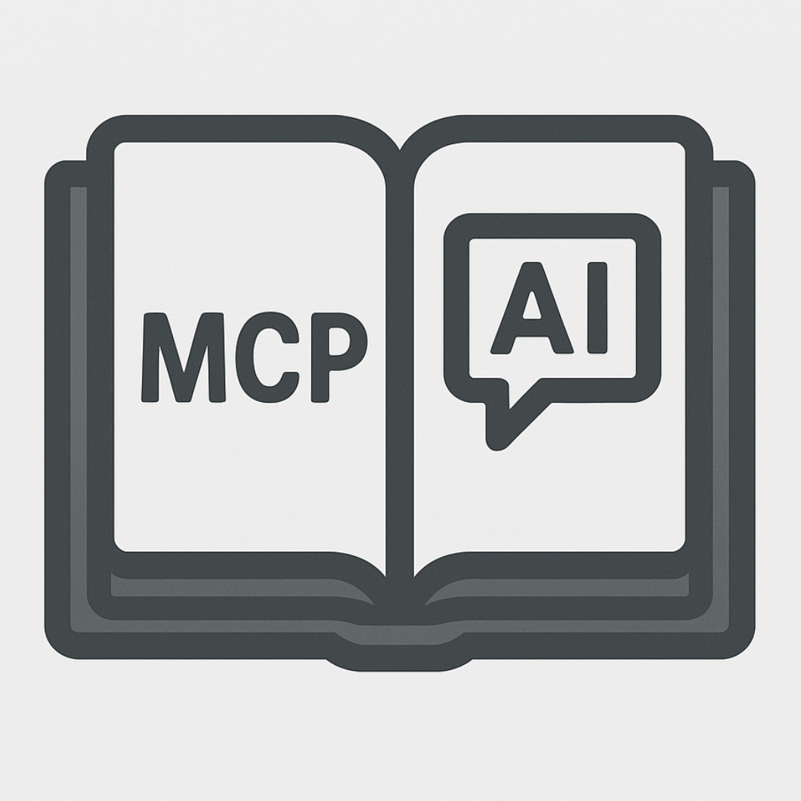

# Ebook-MCP




English | [中文](https://github.com/onebirdrocks/ebook-mcp/blob/main/README-CN.md)

Ebook-MCP is a powerful Model Context Protocol (MCP) server for processing electronic books. Built on the [Model Context Protocol](https://github.com/modelcontextprotocol), it provides a set of standardized APIs for seamless integration between LLM applications and e-book processing capabilities. Currently supports EPUB and PDF formats.

## Use Cases & Value

Ebook-MCP transforms how you interact with your digital books by enabling natural language conversations with your reading materials. It seamlessly integrates with modern AI-powered IDEs like Cursor and Claude, allowing you to:

- **Smart Library Management**: Simply ask "Show me all EPUB files in my downloads folder" or "Find books about GenAI in my library"
- **Interactive Reading Experience**: Have natural conversations about your books:
  - "Give me a brief introduction to 'LLM Engineer Handbook'"
  - "What's covered in Chapter 3?"
  - "Summarize the key points about RAG from this book"
- **Active Learning Support**: Enhance your learning through AI-powered interactions:
  - "Create a quiz based on the RAG concepts from Chapter 5"
  - "Explain the differences between the architectures discussed in this chapter"
  - "Give me practical exercises based on the concepts in this section"
- **Content Navigation**: Easily navigate through your books with natural language queries:
  - "Find all sections discussing prompt engineering"
  - "Show me the chapters about fine-tuning"
  - "Take me to the part about vector databases"

By bridging the gap between traditional e-books and AI capabilities, Ebook-MCP helps readers extract more value from their digital library through intuitive, conversation-based interactions.

Quick demo - Run with Deep Seek (Please check all the example's with Claude/OpenAI under mcp-client-example folder) 
```
Query:Please check all the epub books in my download folder. user id is onebird.
......

Query: Can you ask me a few questions to test my understanding of this book?


Answer: Sure! Here are 5 questions about Elon Musk by Walter Isaacson to test your understanding of the book. Please answer based on your knowledge — I’ll give feedback and add details after each response.

Question 1:
How did Musk’s childhood and family background shape his personality and career later in life?
(Hint: His relationship with his father, growing up in South Africa, etc.)

Question 2:
Zip2 and X.com (later PayPal) were Musk’s early startups. What problems did they solve? How did Musk eventually exit from these companies?
(Hint: Zip2’s business model, X.com’s merger with Confinity, etc.)

Question 3:
In 2008, both SpaceX and Tesla were on the verge of bankruptcy. How did Musk save these two companies?
(Hint: Falcon 1’s fourth launch, NASA contract, Tesla’s last-minute rescue, etc.)

Question 4:
What controversies surround Musk’s management style? What specific incidents in the book illustrate his “hardcore” or “extreme” work culture?
(Hint: Fremont factory’s “production hell,” Twitter layoffs, etc.)

Question 5:
What is Musk’s attitude toward Artificial Intelligence (AI)? Why did he simultaneously support both OpenAI and Neuralink, which seem to have conflicting goals?
(Hint: AI as an existential threat, brain-machine interface vision, etc.)

Please answer each question. I’ll provide feedback and additional details or correct any misunderstandings!
(If a question isn’t clear, feel free to ask me.)

Query:
Question 1: His father’s abusive attitude made him less empathetic towards others.
Question 2: Zip2 solved the problem of electronic maps and online yellow pages. X.com solved online payments.
Question 3: He secured a contract with NASA. Tesla solved its production problems by building a factory in China.
Question 4: I don’t know. Please answer for me.
Question 5: He believes open-source technology is necessary to ensure AI is safe and open.

Answer: Your answers have captured some key points from the book. Let me add details, correct some inaccuracies, and provide further background for Questions 4 and 5:

Question 1 — Correction & Supplement
Influence of His Father:
Musk's father, Errol, was indeed extremely harsh — for example, forcing young Elon to kneel and count grains of rice for hours. The book emphasizes that this emotional desensitization shaped Musk into an extremely goal-oriented person — indifferent to others’ suffering but obsessively committed to his goals.

Reverse Impact:
It’s not that Musk is incapable of empathy — it’s selective. For instance, he may treat employees coldly but personally study medical equipment for his son X’s health issues.

Question 2 — Correction & Supplement
Zip2:
Essentially an online Yellow Pages + map navigation service (helping newspapers go online). Musk wrote much of the early code himself and slept in the office. Eventually, Compaq acquired Zip2 for $307 million (Musk received $22 million).

X.com:
Not just online payments — it was Musk’s attempt to create a comprehensive financial platform (aiming to replace banks). Later merged with Confinity (the precursor of PayPal). Musk was ousted due to internal conflicts, but when eBay acquired PayPal, Musk earned $180 million.
(Note: Musk later bought back the domain X.com — it’s now Twitter’s parent company name).

Question 3 — Correction & Supplement
SpaceX:
In 2008, Falcon 1 succeeded on its fourth launch (after three failures drained their funds). Right after that, SpaceX secured a $1.6 billion NASA contract for cargo resupply — a lifeline for the company.

Tesla:
In 2008, Tesla survived through a $50 million investment from Daimler and a loan from the U.S. Department of Energy.
Building the Gigafactory in China (2019) came much later. In the early years, survival depended on the launch of Model S (2012) and Musk’s personal gamble — selling all his real estate to fund Tesla.

Question 4 — Explanation: Controversy Around His Management Style
“Hardcore” Culture:

At SpaceX/Tesla: Musk demanded employees work 80+ hours per week, even sleeping at the factory. ("If you’re not here, your replacement is.")

After acquiring Twitter: He immediately laid off 75% of staff and asked the remaining employees to sign a "hardcore commitment" — agreeing to long hours and high-intensity output.

Extreme Cases:

At the Fremont Factory: During the "production hell" of the Model 3, Musk slept on the production line and once yelled at employees calling them "worse than dogs" (he later apologized).

Firing Executives: Musk once fired a senior Tesla executive on the spot because the font size in their PowerPoint presentation wasn’t big enough.

Question 5 — Correction & Supplement
AI Threat Theory:
Musk believes that AI could destroy humanity ("more dangerous than nuclear weapons"). Therefore:

OpenAI: He initially supported it to promote safe, open-source AI (but left later due to disputes over control).

Neuralink: He aims to use brain-machine interfaces to merge humans with AI — to prevent humans from being left behind.

Contradictions:
While warning about AI risks, Musk is simultaneously pushing for Full Self-Driving (FSD) technology at Tesla and has founded xAI to research Artificial General Intelligence (AGI).

Overall Evaluation:
✅ You have captured the key events accurately, but the details need to be strengthened (such as timelines and specific figures).
🔍 Recommended areas for further study: Musk's multi-threaded management style (running five companies simultaneously) and his skill in media manipulation (governing through Twitter).
```

## Features

### EPUB Support
- Extract metadata (title, author, publication date, etc.)
- Extract table of contents
- Extract chapter content (with Markdown output)
- Batch process EPUB files

### PDF Support
- Extract metadata (title, author, creation date, etc.)
- Extract table of contents
- Extract content by page number
- Extract content by chapter title
- Markdown output support
- Batch process PDF files

## Installation

1. Clone the repository:
```bash
git clone https://github.com/yourusername/ebook-mcp.git
cd ebook-mcp
```

2. Install dependencies using `uv`:
```bash
uv pip install -r requirements.txt
```

## Usage

### Starting the MCP Server in development mode

Run the server in development mode:
```bash
uv run mcp dev src/ebook_mcp/main.py
```
You can visit http://localhost:5173/ for testing & debuging purpose

### Starting the MCP Server in Prod mode

Run the server:
```bash
uv run src/ebook_mcp/main.py
```


#### Config the MCP in Cursor

Add the following configuration in Cursoe
```bash
"ebook-mcp":{
            "command": "uv",
            "args": [
                "--directory",
                "/Users/onebird/github/ebook-mcp/src/ebook_mcp/",
                "run",
                "main.py"
            ]
        }
```


### EPUB Processing Examples

```python
# Get all EPUB files in a directory
epub_files = get_all_epub_files("/path/to/books")

# Get EPUB metadata
metadata = get_metadata("/path/to/book.epub")

# Get table of contents
toc = get_toc("/path/to/book.epub")

# Get specific chapter content (in Markdown format)
chapter_content = get_chapter_markdown("/path/to/book.epub", "chapter_id")
```

### PDF Processing Examples

```python
# Get all PDF files in a directory
pdf_files = get_all_pdf_files("/path/to/books")

# Get PDF metadata
metadata = get_pdf_metadata("/path/to/book.pdf")

# Get table of contents
toc = get_pdf_toc("/path/to/book.pdf")

# Get specific page content
page_text = get_pdf_page_text("/path/to/book.pdf", 1)
page_markdown = get_pdf_page_markdown("/path/to/book.pdf", 1)

# Get specific chapter content
chapter_content, page_numbers = get_pdf_chapter_content("/path/to/book.pdf", "Chapter 1")
```

## API Reference

### EPUB APIs

#### `get_all_epub_files(path: str) -> List[str]`
Get all EPUB files in the specified directory.

#### `get_metadata(epub_path: str) -> Dict[str, Union[str, List[str]]]`
Get metadata from an EPUB file.

#### `get_toc(epub_path: str) -> List[Tuple[str, str]]`
Get table of contents from an EPUB file.

#### `get_chapter_markdown(epub_path: str, chapter_id: str) -> str`
Get chapter content in Markdown format.

### PDF APIs

#### `get_all_pdf_files(path: str) -> List[str]`
Get all PDF files in the specified directory.

#### `get_pdf_metadata(pdf_path: str) -> Dict[str, Union[str, List[str]]]`
Get metadata from a PDF file.

#### `get_pdf_toc(pdf_path: str) -> List[Tuple[str, int]]`
Get table of contents from a PDF file.

#### `get_pdf_page_text(pdf_path: str, page_number: int) -> str`
Get plain text content from a specific page.

#### `get_pdf_page_markdown(pdf_path: str, page_number: int) -> str`
Get Markdown formatted content from a specific page.

#### `get_pdf_chapter_content(pdf_path: str, chapter_title: str) -> Tuple[str, List[int]]`
Get chapter content and corresponding page numbers by chapter title.

## Dependencies

Key dependencies include:
- ebooklib: EPUB file processing
- PyPDF2: Basic PDF processing
- PyMuPDF: Advanced PDF processing
- beautifulsoup4: HTML parsing
- html2text: HTML to Markdown conversion
- pydantic: Data validation
- fastmcp: MCP server framework

## Important Notes

1. PDF processing relies on the document's table of contents. Some features may not work if TOC is not available.
2. For large PDF files, it's recommended to process by page ranges to avoid loading the entire file at once.
3. EPUB chapter IDs must be obtained from the table of contents structure.

## Architecture

```
           ┌────────────────────────────┐
           │         Agent Layer        │
           │  - Translation Strategy    │
           │  - Style Consistency Check │
           │  - LLM Call & Interaction │
           └────────────▲─────────────┘
                        │ Tool Calls
           ┌────────────┴─────────────┐
           │        MCP Tool Layer     │
           │  - extract_chapter        │
           │  - write_translated_chapter│
           │  - generate_epub          │
           └────────────▲─────────────┘
                        │ System/IO Calls
           ┌────────────┴─────────────┐
           │     System Base Layer     │
           │  - File Reading          │
           │  - ebooklib Parsing      │
           │  - File Path Storage/Check│
           └────────────────────────────┘
```


## Contributing

We welcome Issues and Pull Requests!


## Changelog

### v1.0.5
- Initial release
- EPUB and PDF format support
- Basic file processing APIs
- MCP Client examples - Claude, DeepSeek, OpenAI
- Support to run the server from PyPI
